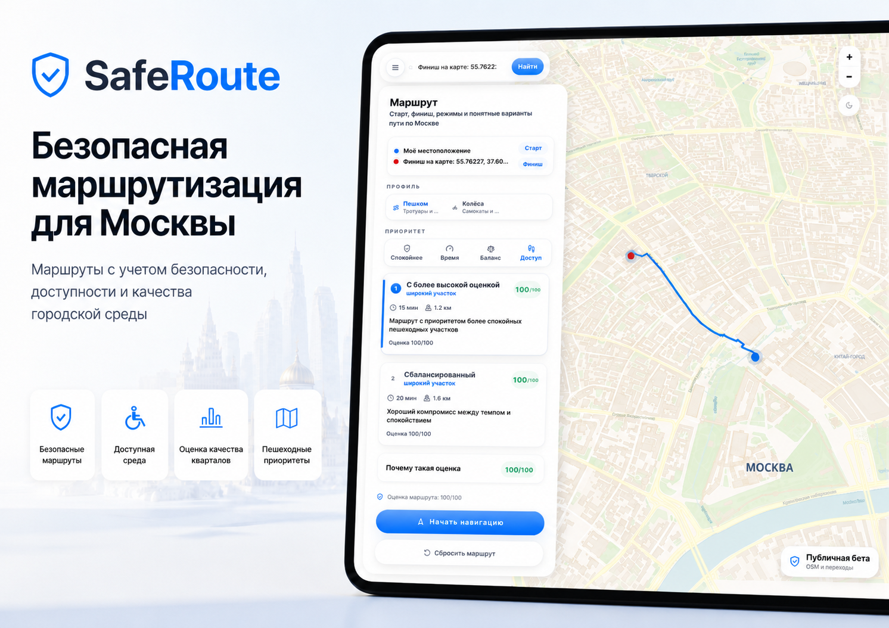
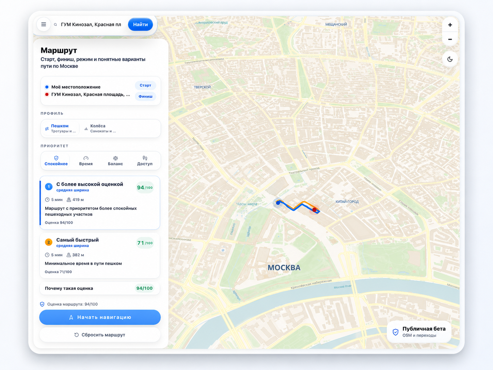
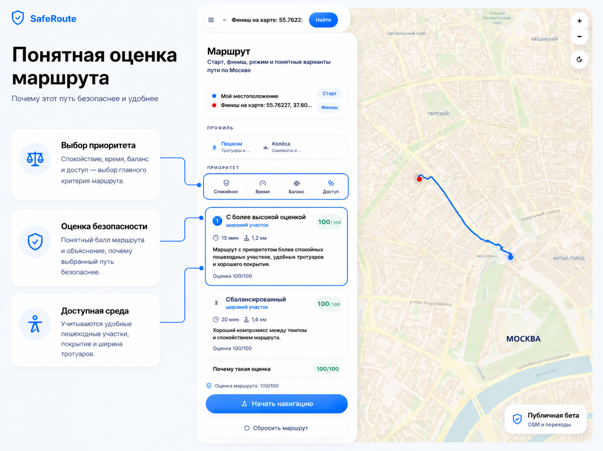

# saferoute-Moscow

## Безопасная маршрутизация для Москвы

saferoute-Moscow — urban-tech платформа для безопасной городской маршрутизации по Москве.

Сервис помогает строить маршруты не только по времени и расстоянию, но и с учетом безопасности, доступности и качества городской среды: спокойных пешеходных участков, ширины маршрута, покрытия, переходов, освещения и других факторов, полученных из реальных геоданных.

<p align="center">
  
</p>

<p align="center">
  
  
  
  
  
</p>

---

## Идея проекта

Обычные навигаторы чаще всего выбирают самый быстрый или самый короткий путь.  
Но в городе такой маршрут не всегда оказывается самым безопасным и удобным.

Для пешеходов, велосипедистов, пользователей СИМ, родителей с колясками, курьеров и маломобильных жителей важны не только минуты в пути, но и качество самого маршрута:

- спокойные улицы и пешеходные зоны;
- удобные тротуары;
- понятные переходы;
- покрытие и качество дорожной среды;
- освещение;
- доступность;
- минимизация потенциально небезопасных участков.

**saferoute-Moscow добавляет к маршрутизации слой городской безопасности.**  
Проект показывает не просто линию на карте, а объяснимый маршрут с оценкой и понятными причинами выбора.

---

## Что умеет saferoute-Moscow

| Возможность | Описание |
|---|---|
| **Безопасный маршрут** | Строит путь с приоритетом спокойных, удобных и более безопасных участков |
| **Быстрый маршрут** | Показывает вариант с минимальным временем в пути |
| **Баланс** | Подбирает компромисс между скоростью и безопасностью |
| **Доступность** | Учитывает удобство маршрута для пешеходов и доступной городской среды |
| **Оценка маршрута** | Показывает score и объясняет, почему маршрут получил такую оценку |
| **Реальные геоданные** | Использует OpenStreetMap-derived enrichment, PostGIS и pgRouting |
| **Self-hosted стек** | Может работать на собственном backend-стеке без зависимости от публичных routing-сервисов |

---

## Главный экран

saferoute-Moscow показывает маршрут на карте Москвы, карточки вариантов пути и понятную оценку безопасности.

<p align="center">
  
</p>

На главном экране пользователь может:

- выбрать начальную и конечную точку;
- выбрать профиль движения;
- задать приоритет маршрута;
- сравнить варианты;
- увидеть итоговую оценку;
- запустить навигацию.

---

## Понятная оценка маршрута

saferoute-Moscow объясняет, **почему один маршрут может быть безопаснее другого**.

<p align="center">
  
</p>

Оценка маршрута учитывает:

- выбранный приоритет: спокойнее, время, баланс или доступность;
- характеристики участков маршрута;
- качество покрытия;
- наличие тротуаров;
- освещение;
- переходы;
- safety-факторы дорожного графа.

Если для какого-то слоя нет надежных данных, saferoute-Moscow не делает искусственных выводов и не добавляет фиктивные бонусы или штрафы.

---

## Интерфейс продукта

Интерфейс saferoute-Moscow сделан как рабочий городской сервис: карта, маршрут, карточки вариантов и понятное объяснение результата находятся в одном экране.

<p align="center">
  
</p>

В интерфейсе есть:

- поиск точки назначения;
- старт и финиш маршрута;
- профиль движения;
- приоритет маршрута;
- карточки вариантов;
- оценка безопасности;
- карта Москвы с построенным маршрутом;
- публичная beta-метка.

---

## Для кого

saferoute-Moscow может быть полезен:

- жителям Москвы;
- пешеходам;
- велосипедистам и пользователям СИМ;
- родителям с колясками;
- маломобильным пользователям;
- курьерам;
- городским сервисам;
- девелоперам и проектам, связанным с городской средой.

---

## Почему Москва

Москва — сложный и насыщенный город с точки зрения мобильности.  
В одном маршруте могут сочетаться широкие улицы, дворы, переходы, пешеходные зоны, набережные, магистрали, узкие участки и места с разным качеством покрытия.

saferoute-Moscow разрабатывается как **Moscow-first платформа**: сначала для Москвы и Московской области, затем как масштабируемая модель для других городов.

---


## Технологический стек

### Frontend

- React
- Vite
- MapLibre
- React Map GL

### Backend

- FastAPI
- Pydantic
- SQLAlchemy
- PostgreSQL
- PostGIS
- pgRouting

### Routing & Geo

- Valhalla
- Photon
- H3
- OpenStreetMap / Geofabrik extract
- Moscow + Moscow Oblast data

### Infrastructure

- Docker Compose
- Self-hosted backend stack
- Smoke tests
- Health checks
- Data bootstrap scripts

---

## Локальный запуск

```bash
./venv/bin/python -m pip install -r requirements-dev.txt
npm run dev:full
```

Открыть:

```txt
http://localhost:5173
```

Vite dev server проксирует `/api/*` и `/route` на `localhost:8000`.

`npm run dev:full` запускает Postgres.app на порту `5433`, если существует локальная директория данных Postgres, затем одновременно запускает FastAPI и Vite.

Для локальной разработки включается публичный fallback для Photon/Valhalla.  
Для production-like режима нужно использовать Docker/self-hosted сервисы.

Для разработки только API:

```bash
npm run dev:api
```

Эта команда запускает FastAPI на порту `8000` с текущим окружением.  
Она не запускает Postgres, Photon или Valhalla.

Когда нужны реальные зависимости, используй Docker Compose или self-hosted bootstrap.

---

## Docker Stack

Полный production-like чеклист с требованиями, портами, переменными окружения, данными и troubleshooting находится здесь:

[Self-Hosted Backend Stack](docs/SELF_HOSTED.md)

```bash
docker compose up
```

Базовый compose stack — это production-like локальный runtime:

- `frontend` отдает собранное приложение через `vite preview`;
- `api` запускается без `--reload`;
- публичный fallback по умолчанию отключен;
- исходный код встроен в images, а не подключается через bind mount.

Postgres запускается с включенными PostGIS и pgRouting.

Полный self-hosted bootstrap копирует существующий Moscow safety graph из локальной host DB в compose DB, подготавливает production routing columns/indexes, ждет готовности Photon и Valhalla, затем запускает bundled smoke tests.

---

## Self-Hosted Moscow + Oblast Data

Production-like локальная работа должна запускаться без публичного fallback для Photon/Valhalla:

```bash
npm run self-hosted:preflight
npm run bootstrap:self-hosted
```

Или пошагово:

```bash
npm run self-hosted:up
npm run self-hosted:ps
npm run self-hosted:logs
```

Внутренние шаги data bootstrap:

```bash
scripts/data/download-osm.sh
scripts/data/extract-moscow-oblast.sh
scripts/data/import-safety-graph.sh
scripts/data/build-routing-stack.sh
npm run db:graph-export
npm run db:graph-restore
npm run bootstrap:check
npm run bootstrap:fresh
```

Bootstrap pipeline:

- скачивает официальный PBF-файл Geofabrik Central Federal District;
- извлекает Москву + Московскую область через `osmium`;
- импортирует `public.moscow_network`;
- применяет `scripts/prepare-production-db.sql`;
- запускает Docker stack с `ALLOW_PUBLIC_SERVICE_FALLBACK=false`;
- ждет `GET /api/health?deep=true`;
- запускает `scripts/smoke-self-hosted.sh`.

Photon остается self-hosted в Docker, но его локальный индекс создается внутри container volume при первом запуске.  
Valhalla использует repo-local extract `data/osm/moscow-oblast.osm.pbf`.

---

## Enrichment Data

Расширенные safety-слои хранятся в:

```txt
public.safety_edge_enrichment
```

Они опциональны: маршруты работают с базовым `safety_weight` из `moscow_network`, но полный enrichment улучшает покрытие и confidence.

### Проверка enrichment status

```bash
npm run enrichment:check
```

Команда показывает:

- количество строк базового графа;
- количество enrichment rows;
- активные enrichment datasets;
- summary: `full`, `base_graph_only` или `missing`.

### Импорт OSM enrichment

Если enrichment не активен, импортируй его из OSM extract:

```bash
bash scripts/data/download-osm.sh
bash scripts/data/extract-moscow-oblast.sh
npm run enrichment:import
```

Импорт:

- генерирует CSV для basic tags;
- проверяет edge mapping;
- загружает данные в `public.safety_edge_enrichment`;
- активирует dataset через `is_active=true`.

После импорта повторно запусти:

```bash
npm run enrichment:check
```

---

## Структура backend

Живой API package находится в `app/`.

Root `main.py` нужен только как compatibility entrypoint для:

```bash
uvicorn main:app
```

```text
app/api        HTTP routers
app/core       settings, database, observability
app/schemas    Pydantic API contracts
app/services   routing, search, health, telemetry
```

Legacy folders `backend/` и `saferoute-core/` не являются live runtime paths.

---

## Проверки

Статус backend verification и точные pass/fail критерии описаны здесь:

[Backend Verification](docs/BACKEND_VERIFICATION.md)

```bash
npm run lint
npm run check:trust-copy
npm run check:release-readiness
npm run typecheck:backend
npm run test:backend
npm run db:telemetry-check
npm run db:migrate
npm run db:migration-check
npm run db:graph-check
npm run db:graph-source-check
npm run db:enrichment-check
npm run build
npm run smoke:api
npm run smoke:self-hosted
npm run route:corpus-check
npm run perf:route-smoke
npm run perf:telemetry-smoke
npm run bootstrap:self-hosted
npm run self-hosted:preflight
npm run self-hosted:check
```

`npm run smoke:api` проверяет реально запущенный API process и не подменяет зависимости.  
Команда завершится ошибкой с инструкцией запуска, если `127.0.0.1:8000` недоступен.

`npm run smoke:self-hosted` запускает полный dependency и routing smoke. Для успешной проверки нужны здоровые PostGIS с `moscow_network`, Photon и Valhalla.

Backend-only passing state:

```bash
npm run check:backend
npm run smoke:api
```

Полный self-hosted passing state требует:

```bash
npm run self-hosted:preflight
npm run smoke:self-hosted
```
npm run smoke:api проверяет реально запущенный API process и не подменяет зависимости.
Команда завершится ошибкой с инструкцией запуска, если 127.0.0.1:8000 недоступен.

npm run smoke:self-hosted запускает полный dependency и routing smoke. Для успешной проверки нужны здоровые PostGIS с moscow_network, Photon и Valhalla.

Backend-only passing state:

npm run check:backend
npm run smoke:api

Полный self-hosted passing state требует:

npm run self-hosted:preflight
npm run smoke:self-hosted

---

## Документация

- [Architecture](docs/architecture.md)
- [Auth And Rate-Limit Rollout](docs/AUTH_RATE_LIMIT_PLAN.md)
- [Backend Production Readiness](docs/BACKEND_PRODUCTION_READINESS.md)
- [Backend Verification](docs/BACKEND_VERIFICATION.md)
- [Graph Data Quality](docs/GRAPH_DATA_QUALITY.md)
- [Graph Bootstrap Requirement](docs/GRAPH_BOOTSTRAP_REQUIRED.md)
- [Enrichment Data Model](docs/ENRICHMENT_DATA.md)
- [Enrichment Sources](docs/ENRICHMENT_SOURCES.md)
- [Scoring Factors](docs/SCORING_FACTORS.md)
- [Trust Architecture](docs/TRUST_ARCHITECTURE.md)
- [Explainability Model](docs/EXPLAINABILITY_MODEL.md)
- [Beta Safety Limits](docs/BETA_SAFETY_LIMITS.md)
- [Privacy And Telemetry](docs/PRIVACY_AND_TELEMETRY.md)
- [Public Beta Readiness](docs/PUBLIC_BETA_READINESS.md)
- [Release Checklist](docs/RELEASE_CHECKLIST.md)
- [Production Readiness Gaps](docs/PRODUCTION_READINESS_GAPS.md)
- [Observability](docs/OBSERVABILITY.md)
- [Scoring Governance](docs/SCORING_GOVERNANCE.md)
- [Data Freshness Policy](docs/DATA_FRESHNESS_POLICY.md)
- [Incident Response](docs/INCIDENT_RESPONSE.md)
- [Security Review](docs/SECURITY_REVIEW.md)
- [Weather Risk](docs/WEATHER_RISK.md)
- [Telemetry Confidence](docs/TELEMETRY_CONFIDENCE.md)
- [Public Beta Release Notes](docs/PUBLIC_BETA_RELEASE_NOTES.md)
- [Data Attribution](docs/DATA_ATTRIBUTION.md)
- [Full Safety Launch Roadmap](docs/FULL_SAFETY_LAUNCH_ROADMAP.md)
- [Migration Plan](docs/MIGRATION_PLAN.md)
- [Public Launch Security](docs/SECURITY_PUBLIC_LAUNCH.md)
- [Production Security Env](docs/SECURITY_PRODUCTION_ENV.md)
- [Public Launch Operations](docs/OPERATIONS_PUBLIC_LAUNCH.md)
- [Route Quality Corpus](docs/ROUTE_QUALITY_CORPUS.md)
- [Backup And Restore](docs/BACKUP_RESTORE.md)
- [Incident Runbook](docs/RUNBOOK.md)
- [Routing and Safety](docs/routing-safety.md)
- [Scoring Roadmap](docs/scoring-roadmap.md)
- [Self-Hosted Backend Stack](docs/SELF_HOSTED.md)
- [Frontend Motion System](docs/frontend-motion.md)
- [Figma Handoff](docs/figma-handoff.md)
- [Operations Runbook](docs/operations.md)
- [Telemetry And Edge Roadmap](docs/telemetry-edge.md)
- [Transit Roadmap](docs/transit-roadmap.md)
- [Official References](docs/references.md)

---

## Roadmap

### Сейчас

- public beta / self-hosted MVP;
- маршруты по Москве и Московской области;
- safety-first scoring;
- OSM-derived enrichment;
- PostGIS + pgRouting safety graph;
- Valhalla / Photon routing stack;
- объяснимая оценка маршрута.

### Следующий этап

- улучшение accessible routing;
- расширение покрытия safety-факторов;
- подключение дополнительных проверенных источников данных;
- улучшение интерфейса объяснения маршрутов;
- пилотирование на выбранных городских сценариях.

### Дальше

- API для партнеров;
- dashboard для анализа городской среды;
- расширение на другие города;
- production-ready публичный запуск после валидации safety-слоев.

---

## Принципы проекта

- Не использовать фиктивные данные для красивой демонстрации.
- Не показывать неактивные safety-слои как готовые.
- Не создавать штрафы или бонусы без реального источника данных.
- Делать маршрутизацию объяснимой.
- Развивать продукт вокруг пользы для Москвы и жителей.

---


**saferoute-Moscow — это сервис безопасной маршрутизации для Москвы, который соединяет карты, routing, реальные городские данные и понятную оценку маршрута в одном продукте.**
