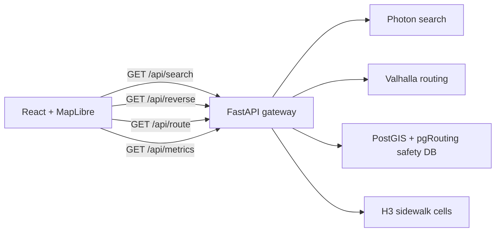

# SafeRoute Architecture

## Runtime Shape

SafeRoute v2.1 uses one browser-facing API:

The frontend never calls public Nominatim. Search, reverse geocoding, routing, safety enrichment, and health checks all go through FastAPI.

## Services

- `frontend`: Vite React app, MapLibre map, Motion animations, GPS navigation state.
- `api`: FastAPI BFF/gateway. The runtime package is `app/`; root `main.py` imports `app.main:app` for compatibility.
- `photon`: search-as-you-type geocoder. Local Docker target is `http://photon:2322`; local dev can use `PHOTON_URL`.
- `valhalla`: canonical maneuver and route engine. Local Docker target is `http://valhalla:8002`; local dev can use `VALHALLA_URL`.
- `db`: Postgres with PostGIS and pgRouting. The required production table is `moscow_network`; telemetry adds `sidewalk_samples` and `sidewalk_cell_aggregates`.

## Browser API Contract

- `GET /api/search?q=<text>&limit=<n>` returns `id`, `label`, `lat`, `lon`, `bbox`, `kind`.
- `GET /api/reverse?lat=<>&lon=<>` returns the same place shape plus `source`.
- `GET /api/route?lat1&lon1&lat2&lon2&profile=<walk|bike|car>&mode=<safest|fastest|balanced|accessible>&alternatives=3` returns GeoJSON `routes[]` with backward-compatible `properties.safety_index` and additive `properties.score` explanations.
- `GET /route` is a temporary compatibility alias for `/api/route`.
- `GET /api/health` reports `postgres`, `photon`, `valhalla`, and optional per-profile readiness; public fallback usage is surfaced as `fallback`/`degraded`, not hidden as `ok`.
- `GET /api/metrics` exposes local Prometheus text metrics for request latency, dependency latency, route cache, route variants, and routing failures.
- `POST /api/telemetry/sidewalk-samples` ingests batched sidewalk-quality observations.
- `GET /api/sidewalk-cells?bbox=<minLon,minLat,maxLon,maxLat>&resolution=<n>` returns aggregated H3 cells as GeoJSON.

## Frontend Architecture

The app shell keeps the map-first Apple/Liquid Glass flow, while implementation is split by responsibility:

- `src/api/client.js`: browser-facing API calls only through same-origin `/api/*`.
- `src/config/safeRoute.js`: app tabs, profile options, map constants, motion timings.
- `src/components/AppPanels.jsx`: tab rail, route cards, instruction chip, trip sheet, settings/layers panels.
- `src/hooks/*`: domain hooks for health, search, route loading, navigation progress, and sidewalk cells.
- `src/lib/route-utils.js`: geometry, route normalization, progress, and instruction presentation helpers.

Heavy runtime chunks are split in Vite: `maplibre`, `motion`, and `icons`.

## No Placeholder Policy

Only `walk`, `bike`, and `car` are shown in the live UI. Transit is not displayed until GTFS routing is connected.
